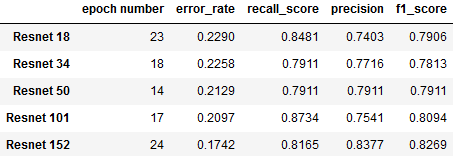

# Abstract
The automated diagnosis of Myocardial Infarction (MI) in 12-lead Electrocardiograms (EKGs) could extend the proven lifesaving benefits of pre-hospital MI detection to many Emergency Medical Services (EMS) systems currently without them.  While neural networks have been developed that accurately diagnose MI, such networks are difficult to deploy in clinical practice due to operating on digitized signal data rather than images of EKG waveforms, of which no large publicly available dataset exists.  We create such a dataset by plotting digitized EKG records from the Physionet PTB-XL dataset to simulate images of 12-lead EKG printouts.  We then train a FastAI CNN learner on the resulting dataset, comparing the accuracy of different network architectures and hyperparameters.  We also attempt to train an RNN by inputting individual images of each EKG lead separately.  Our results include the generation of a dataset containing 21,837 simulated 12-lead EKG images labeled as “MI” or “Normal”, along with a version augmented with simulated shadows, an alternative version plotted directly with MatPlotLib, and a final version containing each lead in a separate image for use in an RNN.  Our trained CNN classifies this dataset achieves an accuracy of 90%, sensitivity 72%, and specificity of 83%, while our RNN fails to train successfully.  Similar accuracy is achieved on both the augmented dataset with shadows and alternate directly plotted version.  These results show the ability of a CNN to detect MI in images of 12-lead EKGs, indicating the potential for developing a CNN-based application to automatically perform such detection in clinical practice.  While the sensitivity of our trained model is not yet high enough for clinical use, our generated dataset allows future researchers to develop techniques improving on our results.  It is our hope that such efforts will eventually lead to the development of an model trained on real EKG images that can be deployed in EMS systems to substantially reduce mortality for MI patients.

# Introduction

Heart disease is consistently the number one cause of death in America, and 805,000 heart attacks occur in the US annually. [\[1\]](#Citations)  Effective heart attack treatment relies on rapid diagnosis through 12-lead EKG in order to minimize the time to reperfusion therapy, and one of the largest improvements in the speed of diagnosis and treatment has been achieved through pre-hospital EKG analysis by EMS personnel.  For instance, one study found pre-arrival EMS identification of ST-Elevated Myocardial Infarction (STEMI) through 12-lead EKG lowered patients’ 30-day mortality rates from 15.3% to 7.3%, and 5-year mortality rates from 20.6% to 11.6%. [\[2\]](#Citations)

Yet despite the well-established lifesaving effects of performing pre-hospital 12-lead EKGs, many EMS systems continue to rely on Basic Life Support-level (BLS) providers untrained in EKG interpretation.  For instance, the Detroit EMS system, which handles approximately 100,000 calls annually is predominately staffed by BLS units, and Michigan has a statewide shortage of hundreds of ALS-level paramedics who would be trained to perform EKGs. [\[3\]](#Citations)  The result is that MIs go undetected before hospital arrival, resulting in slower diagnosis, slower treatment, and higher mortality.

In such EMS systems where staff trained in EKG interpretation are unavailable, automatic computer interpretation of EKG could potentially fill in the gap to provide the lifesaving benefits of pre-hospital diagnosis to  heart attack patients.  However, current MI detection algorithms in use on EKG monitors are unreliable.  For instance, one study found that a commonly used EMS monitor identified just 58% of STEMIs, missing the diagnosis in the remaining 42% of STEMI patients. [\[4\]](#Citations)

The past few years have seen researchers achieve breakthrough accuracy levels in automatic EKG interpretation using neural-network based approaches, in many cases rivaling or surpassing the accuracy of clinical providers. [\[6\], \[7\], \[8\]](#Citations)  However, such algorithms have yet to be widely applied to actual healthcare practice.  One barrier to such application has been the fact that all such algorithms to our knowledge have been developed to interpret digital EKG signals, which in the field are only available to software directly interfacing with an EKG monitor.  Clinical implementation of such algorithms would either need to be done on proprietary software run on EKG monitors themselves, or else on hardware with the ability to interface directly with EKG monitors to receive digital signals.  In either case, such implementation would be difficult both for researchers and clinical practitioners.

We attempt to resolve this difficulty by testing an alternate approach to neural-network based STEMi detection using images.  While digital signals are difficult to directly obtain in clinical practice, EKG monitors are equipped with printing capabilities that are routinely used to record readings.  If neural networks can accurately detect STEMis in images of 12-lead EKGs, then such printouts could be used as the basis of classification independently of the specific EKG device.  For instance, we envision an image-based approach being the basis of a mobile phone application that would allow providers to easily take a photo of an EKG printout and have it automatically classified.   Such an application could be developed by any researchers without needing access to proprietary software, and could be applied in clinical practice by healthcare agencies without needing to purchase specialized equipment.  Thus the feasibility of an image-based classification approach for EKGs could represent a large step in bridging the gap between research achievements and clinical practice.

A challenge to this approach, however, is the lack of a publicly available dataset of annotated 12-lead EKG printouts.  To test the feasibility of our approach with publicily available data, we create a dataset by plotting each lead of digital signal-based readings and combining the plots from each lead into a single image.  The result is images that approximate 12-lead EKG printouts.

Another substantial challenge is the fact that, depending on the part of the heart affected by MI, diagnostic features such as ST-elevation can appear in different leads and thus different parts of the image.  This fact requires our neural network to recognize these features regardless of their location.  Furthermore, even baseline EKGs can look dramatically different from patient to patient due to a wide varieties of arrhythmias and the routine presence of noise in readings caused by electrical fluctuations and patient movement during the procedure.  We attempt to overcome these challenges by training on a large and diverse dataset.

Our finished neural network achieves a high level of accuracy, suggesting the feasibility of automatically classifying EKGs through images of printouts.  While our trained network's sensitivity still requires improvement, techniques from prior MI classification studies can likely be employed to make such improvements in future work.  These results support the development of an application for computer STEMi recognition that can be easily integrated into clinical practice, and suggest that such an application can extend the lifesaving benefits of pre-hospital EKG interpretation to patients currently unable to receive it.

Ethical concerns for our project include potential biases in our dataset, which could influence our model’s performance and thus patient outcomes.  Testing an application based on our model in clinical practice will also raise ethical concerns due to not only concerns for patient safety, but the difficulty of obtaining high-quality informed consent from patients suffering from an acute MI.  Finally, the use of neural networks to make clinical treatment decisions raises broader concerns about the influence such practices may have on healthcare system design and practice.

# Related Works:

In this section, we will discuss relevant research pertaining to the application of neural networks to STEMi detection in EKGs. Past studies using convolutional neural networks (CNNs) have achieved high accuracy and sensitivity classifying STEMi's from various sets of leads. A study using 4-lead EKGs, sub-2d convolutional layers, lead asymmetric pooling layers to combine data from the multiple leads to achieve a 96% accuracy classifying Anterior STEMis. The algorithm's real-time performance was tested on a lightweight embedded system and found to be suitable for application in EKG wearable technologies. [\[7\]](#Citations)

A study more pertinent to our project's scope combines image-based deep learniing techniques to improve detection accuracy of an important marker for detecting myocardial ischemia in EKGs: a ST depression change. The CNN created yields an average AUC at 89.6% from an independent set, a mean sensitivity rate at 84.4% and a specificity at 84.9% at selected optimal cutoff thresholds. [\[9\]](#Citations)

Another study using a CNN and 12-lead EKGs, proposed a performance optimization technique through two data pre-processing methods: noise reduction (notch filter and high pass filter) and pulse segmentation (via QRS complex detection). The 
preprocessing techniques improved the sensitivity, specificty, and area under the curve (AUC) of the receiver operatnig characteristic (ROC), enhanncing STEMi detection performance on a 275 EKG record dataset with 179 STEMis and 96 normal. [\[8\]](#Citations)

Due to the complexity of classifiers like CNNs and other neural networks, key decision makers like physicians and experienced clinicians stigmatize the black-box nature of neural network-based diagnoses. A more recent study using a ML fusion model consistening of Logistic Regression (LR), Artificial Neural Network (ANN), and Gradient Boosting Machine (GBM) and modified approach using 554 temporal-spatial features of 12-lead EKGs from a sample size of 1244 patients was able to achieve a 52% gain over commercial software ad 37% gain over "experienced" clinicians. From the study, the researchers concluded that linear classifiers like LR are just as effect as ANN, which lends the use of linear classification favorability in clinical practice [\[10\]](#Citations)

# Methods

## Dataset Generation:
To generate our image datasets, we use the PTB-XL dataset\[[11\], \[12\]](#Citations), a collection of 21,837 labeled EKG records published by Physionet [\[13\]](#Citations).  5,486 (25%) of these EKGs are labelled as indicating Myocardial Infarction, while the remainder are either labelled Normal (9,528 / 44%) or as displaying a different abnormality not indicative of Myocardial Infarction (7,326 / 34%); for our purposes, we consider both of the latter to be "Normal".  Each file is a digital recording of electrical activity in 12 standard ECG leads over 10 seconds, as would typically be seen in the emergency setting when diagnosing Myocardial Infarction.  While the initial recordings were made at 500 Hz, the dataset also offers versions downsampled to 100 Hz, which we use throughout this study due to its closer resemblance to the frequencies measured by heart monitors in emergent clinical practice.

We create an initial dataset by using Physionet's [WFDB-Python](https://github.com/MIT-LCP/wfdb-python) library to read the numerical data from each record into a 12x1000 numpy array.  We then plot the 1000 numerical data points from each lead with Matploblib.  We transform the resulting plot into a 512x512 pixel grayscale image with OpenCV, then after repeating this process for all 12 leads we concatenate the resulting images.  The result is one 3 x 4 image displaying all 12 leads for each patient (see figure in discussion).  We use pandas to extract labels from a CSV file in the initial dataset and move each image to a parent directory indicating its label as "mi" or "normal"; the result is "Dataset 1".

Iterating on our first generation efforts, we then generate a second dataset by using WFDB-Python's plotting functions instead of directly passing numerical data to Matplotlib.  We enable an option in these functions to draw a background grid similar to those typically seen in EKG printouts.  We modify the source code of the WFDB plotting functions to allow the editing of the resulting figure with Matplotlib, then standardize the vertical limits of each plot's display and remove figure features such as tick marks, legends, and axes labels.  As before, each file is moved to a parent directory indicating its label, resulting in "Dataset 2" (see figure in discussion).

We then take our second dataset and attempt to augment our initial data to simulate an irregularity commonly seen in mobile phone photographs of EKG printouts: shadow overlying the image.  We use the [Automold Road Image Augmentation Library](https://github.com/UjjwalSaxena/Automold--Road-Augmentation-Library) to randomly add between 1 and 3 5-vertex shadows to each image in Dataset 2.  We save the results as new images, resulting in "Dataset 3" (see figure in discussion).

Finally, to test the classification of our images using an RNN, we generate a fourth dataset with each lead in its own image.  We use the same methods as for Datset 1, except stopping after generating a figure of each lead with Matplotlib.  No transformation is applied with OpenCV, nor are the images concatenated together.  The result is 12 images for each patient plotting each of the 12 EKG leads separately, making up "Dataset 4" (see figure in discussion).
To come up with our final set of hyperparameters to run on the entire imgset2, we first systematically tested the following resnets: resnet18, resnet34, resnet50. We controlled for the data set size (777 images in both mi and normal folders), batch size (16), epochs (20), and resizing (none). From the results, resnet34produced an error rate of 0.38 at epoch 12. Resnet34 also produced lower training losses and lower validation losses than the other resnets, so we chose resnet34 to systematically test batch size and resizing. In order to save time, we reduced the data set size from 777 to 400 images in each folder.

## Batch Size Testing:
To figure out which batch size produce the best results, we trained the model using 4, 8, 16, 24, 32, 40 and 64 for the batch size and controlled for the other hyperparameters (400 images in the dataset, 15 epochs, and no resizing). From a comparison of the metrics, we determined that 16, 32, and 64 produced the best results. Testing for larger batch sizes proved difficult as we ran into memory errors. However, through controlling the other hyperparameters and conducting resizing testing, we found that resizing had no impact on the results and thus no information is loss in the process of resizing. Thus we were able to resize the images down and increase the batch size to 128. Thus we were able to train the model using 4, 8, 16, 24, 32, 40, 64, and 128 for the batch sizes.

## Resizing Testing:
To figure out the impact of resizing on the results, we trained the model multiple times and changed the resize factors and controlling for the other hyperparameters. Sticking to a resnet34, batch size 16, epochs 15, we vary the resize factor to 300x300, 400x400, 500x500 and compare it to no resizing. Through the results we find that resizing has no impact on the results.

## Training on the Entire Dataset:
We train the model with the entire imgset2 using following sets of hyperparameters: The first trial we use a batch size of 16, 15 epochs, and no resizing (as resizing has no impact). The second trial we use a batch size of 32, 15 epochs, and no resizing. The third trial we use batch size of 64, 15 epochs, and no resizing.

To contextualize the performance of our CNN, we felt compelled to build and train another type of neural network. Ultimately, we decided on the RNN, which is distinguished by its memory capacity — when generating outputs, it recalls things learned from prior inputs. We believed that such a quality would be relevant to EKG classification, as Myocardial Infarction EKGs often contain complementary ST manifestations on the different leads (i.e., an ST elevation in one lead is coupled with an ST depression in other), and we hypothesized that a NN model with the ability to recall characteristics of previous leads would have an upper hand in MI diagnosis. 

The RNN training dataset was adapted from Dataset 4: we converted each patient's 12 lead images (i.e., the images in each subdirectory of Dataset 4) to tensors and stacked them, producing one tensor for every patient. Then, we saved each resulting tensor in a file and added a corresponding mi or normal label. 

To create the RNN, we first adapted a Pytorch implementation of a Convolutional LSTM ([https://github.com/ndrplz/ConvLSTM_pytorch](https://github.com/ndrplz/ConvLSTM_pytorch)), specifying one LSTM layer, 10 hidden layers, and a kernel size of 3. Next, we used Pytorch to flatten the LSTM layer to a single tensor, before applying a linear transformation and a sigmoid activation function. For the RNN training process, we selected Binary Cross Entropy for our cost function, Adam for our optimization algorithm, two for our batch size (to accommodate our GPU memory constraints), and ten for the number of epochs.

# Discussion

## Datasets

Our first generated image dataset successfully plotted EKG waveforms and allowed training of a CNN; however, the generated images bore several striking differences from real-world EKG printouts (see figures below).  First, many images in our dataset show repeated large positive or negative vertical spikes not seen in normal EKG printouts.  While EKG waveforms do contain various peaks and valleys, these also exist in our dataset and bear a distinct shape from the spikes, which instead seem to be the result of single very high or low outlier data points.  EKG readings always contain some amount of noise or artifact, which may be the source of such outlier data points.  Other studies classifying EKG data have pre-processed data with notch or high-pass filters, which would remove extreme outliers; it's possible that clinical EKG monitoring equipment employs similar techniques that prevent such spikes from displaying on printouts.

The images in dataset 1 are also significantly more choppy than typically seen in real EKG printouts.  This can partially be explained by the sampling resolution of our data, which at 100 Hz is significantly higher than resolutions in the 40-60Hz range recorded by many clinical monitors; the result is less "smooth" lines as more fine-grain details of the waveform are captured.  It's also possible that other pre-processing techniques to smooth data are used by clinical equipment, in order to reduce the effects of noise and make waveforms easier for humans to read.  Other notable differences include the lack of a background grid in our images and the separation of each lead by a significant amount of whitespace.

Despite these differences, however, the fact that a CNN was able to classify these images with 89% accuracy indicates that these images successfully visualize the important diagnostic features in each record.  As such, the dataset successfully serves its purpose as a proof of concept for image-based classification of EKGs, despite its lack of realistic representation of the sort of images we were hoping to simulate.

Fig. 1: Image from Dataset 1

Fig. 2: Image of real EKG printout for comparison

Our second dataset addresses many of the issues with the first by utilizing the WFDB library's plotting functions, which eliminates both the large vertical spikes and much of the choppiness in the original images.  Not only does this dataset produce smoother and more realistic looking waveforms, but it also adds a background grid and removes most of the excess whitespace separating images.  However, dataset 2 did introduce a separate issue in the layout of each lead in the image.  While real EKG images are typically arranged in a 3 x 4 grid, these images vertically stack all leads in a single column.  We opted not to horizontally concatenate the leads from each image in this way due to finding that each plot was substantially wider than typically seen in EKG printouts, possibly indicating the 10-second samples in our data represent a longer timespan than is usually captured in a single printout.  While we considered taking a narrower subset of the image, doing so could possibly result in removing the section of the EKG where the key diagnostic features determining it as an MI are present.  Without beaty-by-beat annotation of our dataset, we opted to leave the images in a one-column format.  Again, this dataset was able to be classified with 90%ccuracy by a CNN, indicating that it successfully visualized key diagnostic features and serves as proof of concept for image-based EKG classification.

Fig. 3: Image from dataset 2

Our augmentation in the third dataset successfully simulated one of the most common distortions present in real pictures of EKG printouts: shadow overlaying the image.  While the shadows produced aren’t entirely realistic, they do provide a good test for the sort of artifact a classifier would have to overcome on EKG images captured during clinical practice.

Fig. 4: Image from dataset 3

Finally, our fourth dataset generated individual lead images similar to those that might be captured by photographing part of an EKG printout at a time.  These allowed us to feed sequential images into an RNN to test the performance of such a network on MI classification.

Fig. 5: Image from dataset 4

## Hyperparameter Tuning
Before analyzing the results, let’s first define the [metrics](https://machinelearningmastery.com/precision-recall-and-f-measure-for-imbalanced-classification/#:~:text=Recall%20is%20a%20metric%20that,indication%20of%20missed%20positive%20predictions) used to assess the impact of our hyperparameter tuning on performance:
- Error rate provides a measure of general misclassification. It denotes the proportion of cases where the prediction is wrong (i.e., misclassification of MI EKGs as normal EKGs and vice versa).
- Recall_score provides a measure of missed MI predictions (i.e., misclassification of MI EKGs as normal EKGs). It denotes the number of correct MI predictions made out of all possible MI predictions, and is most commonly used to minimize false negatives. 
- Precision provides a measure of correct MI predictions. It computes the ratio of correct MI predictions to the total number of MI predictions, and is most commonly used to minimize false positives. 
- F1_score provides a single measure of both recall and precision, and is calculated via this formula: (2\*recall_score\*precision) / (recall_score\*precision).

This chart summarizes our findings from experimentation with different variants of ResNet architecture (each distinguished by its number of layers) with batch sizes of 8 for 25 epochs. 
- The two entries for ResNet 18 indicate the best performing epochs for recall_score (0.525) and error_rate (0.229), respectively. 
- The subsequent entry for ResNet 34 displays the best performing epoch for error_rate (0.225). 
- The first entry for ResNet 50 indicates the best performing epoch for recall_score (0.791), and the second entry for error_rate (0.197) and f1_score (0.800). 
- The entry for ResNet 101 displays the best performing epoch for error_rate (0.210) and recall_score (0.873).
- The entry for ResNet 152 indicates the best performing epoch for error_rate (0.174), precision (0.838) and f1_score (0.827). 
We can observe that ResNet 152 outperforms each of the other ResNet models in the categories of error_rate, precision, and f1_score (ResNet 50 was a close second in each category). In other words, with the exception of minimizing false negatives (as measured by recall_score), ResNet 152 is our model of choice for image-based EKG classification.

We decided to pursue further hyperparameter tuning with ResNet 152 while finding the optimal batch size. The following table captures our findings: 

We can observe that a batch size of 8 minimizes error_rate and maximizes f1_score, while a batch size of 16 corresponds to the best recall_score and second lowest error rate. 

Finally, to determine the optimal hyperparameter combinations, we used our top two best-performing ResNets, ResNet 50 and ResNet 152, and batch sizes, 8 and 16, to conduct four trials on the full Dataset 2, 25 epochs each. 

The data indicates that the best-performing hyperparameter combination is ResNet 152 and a batch size of 16, as the model with this combination yields the best values for our two most important measures of performance, error_rate (10.01%) and f1_score (77.92%). Notably, this model can distinguish MI EKGs from normal EKGs with 89.99% accuracy! It is worth noting, however, that each of the four combinations achieved significant classification success: from trial to trial, we can observe that the differences in both metrics are nearly negligible.

According to these graphs, training loss for each of our four final models trended downwards until the 20 epoch mark, where it began to plateau or even experience a slight increase. Validation loss, on the other hand, experienced consistent, shallow decreases until the 20 epoch mark (with the exception of an unforeseen spike at 17 epochs for the ResNet 50 with a batch size of 8), where it began to plateau or trend upwards. These observations (namely, the decreasing training loss coupled with an increasing validation loss) enabled us to conclude that training each model beyond 20 epochs may have resulted in slight overfitting. 

As an addendum to our explorations, we decided to investigate the performance of our best-performing model on Dataset 3 (an augmented version of our dataset, in which shadows overlay a portion of the images). We were able to achieve 89.58% classification accuracy and an f1_score of 77.70%, demonstrating that the data augmentation did not result in a statistically significant decrease in the performance of our model. The following graph captures the decline of training loss that corresponded with the increase in number of epochs and reveals the successful learning that our model underwent. 

## RNN Testing
The RNN we created was unsuccessful: we observed that throughout the entirety of the training process, the cost fluctuated drastically from training sample to training sample, rotating among the values of 0.0, 50.0 and 100.0. Since the training cost exhibited no decreasing or stabilizing patterns, we conclude that our RNN failed to learn.

## Overall results 

Our CNN results suggest the feasibility of image-based EKG classification, although also pointing to the need to augment transfer learning with problem-specific techniques in future work.  While our classifier achieves a high rate of accuracy, its sensitivity is not yet high enough for clinical application, where the acceptable error rate is very low.  Missing an MI could result in lack of treatment that could potentially cause outcomes up to death, while false positive diagnosis could potentially subject a patient to unnecessary invasive procedures with similarly severe consequences.  Error rates in STEMi classification by Emergency Room Physicians are approximately 3% [\[5\]](#Citations), and prior non-image based work has achieved similar levels of accuracy.  Techniques from this prior work could potentially be used to improve our own results,  such as lead pooling and sub 2D convolutional layers[\[7\]](#Citations), and pre-processing images for noise reduction and pulse segmentation[\[8\]](#Citations).  However, our classifier already substantially outperforms general physicians and Emergency Room Residents, who have been found to have accuracy rates of 70% and 68% respectively [\[6\]](#Citations).  It also outperforms the non-neural network based algorithm used in the LifePak 12, one of the most popular devices for pre-hospital 12-lead EKG acquisition by EMS, which one study noted only detected 58% of STEMIs [\[4\]](#Citations).

## Ethics
Our work touches on a number of ethical issues and dilemmas, including: 
- **Who is held responsible in the case where the model's prediction is incorrect and the diagnosis and treatment lead to an unfavorable outcome for the patient?**
   - We imagine that our model would be used in situations where the caregiver is not properly trained to read EKGs, so the patient is already put at risk of inaccurate diagnosis. In this specific case, it seems like the neither the model, nor the caregiver should be held accountable, simply because the latter is not trained to read an EKG and hence respond appropriately already, so the addition of our model would technically only improve the rates of accurate and timely diagnosis. If there's ever an implementation used by medical professionals trained to read EKGs, it seems like they should be the ones responsible, as they are making the final call. In general, our model only analyzes the EKG as accurately as possible, but is not the entity reponsible for the actions taken given this information. To avoid such situations as much as possible, NN models should be implemented in the real world only after certain accuracy is achieved, so that they don't lead to loss of life and other negative consequences. In any situation where the technology is the one that makes the final decision, the developers and manufacturer/company should be held accountable.
- **Issues around collection of sensitive health data - should it be collected in an effort to improve the model? In what way should it be collected?**
  - Data from the real world would be essential in improving the accuracy of the model. In that sense, it would be helpful to collect such data, even though it is highly sensitive. In order to do that in a more sensitive way, this information should be anonymized and consent from the patient should be obtained (once they are able to give it). 
- **Does the data used to train the model capture the heterogeneity of the real world? How can a more comprehensive dataset be assembled?**
  - Most likely the datset we're currently using is not incredibly diverse. A potential way to address this issue is to partner with hospitals and medical centers around the world to collect data from a diverse group of individuals. This approach introduces several complications, such as what incentive would such institutions have to collect and provide that data; having to navigate different health systems and ways that consent is obtained (would consent obtained in, for example, Vietnam be accepted in wherever the company is situated/headquartered?); and other logistical questions.
- **How do we find and remove potential biases in the dataset?** 
  - Similarly to the previous question, we need to make sure that we are gathering data from different parts of the world instead of just one hospital or just one country. Similarly, finding potential biases would require testing the model on a diverse range of data.
- **Who benefits from the development and potential commercialization of such a tool?**
  - The main beneficiary (at least financially) would definitely be the company that owns the product. The introduction of such a technology aims at improving the rates of correct and timely diagnoses and consequently lower the rates of improper treatment or even death. Therefore, a model that is able to accurately read EKGs would also benefit health workers and patients. Additionally, if the model reaches a high accuracy rate, it may even be beneficial for smaller or under-funded hospitals and medical institutions, as it would allow a quick and relatively cheap solution to diagnosing patients. This raises other important ethical questions about technology replacing humans and taking over what could potentially be jobs performed by people.

Addressing these questions in depth is important in assessing the model and making sure that introducing it into the health system will be beneficial and not cause harm.

# Reflection

Our work mostly acts as a proof of concept, pointing to the possibility of future work by researchers with access to proprietary EKG image datasets and/or partnership with clinical researchers to confirm the viability of classifying EKG images obtained in real clinical settings. While our goal was to create an app that assists EMTs and other health professionals in quickly and accurately diagnosing patients, we recognize that our current model requires more work and calibration to achieve this. For example, the image dataset that we generated is still not sufficiently similar to real EKGs, or what a picture of an EKG may look like. While we tried to plot and visualize the data to resemble as closely as possible an actual EKG, improvements can be made. For example, the plot lines can be made to appear red, which is typically the color of EKGs (see Fig. 2); further image augmentation and more realistic shadows may be implemented to mimic real-world pictures; in general, improvements in the visual representation of the data that make it appear more similar to real EKG printouts may lead to lower error rates when the model is tested on real pictures. Ideally, a dataset of real pictures of EKGs can be assembled and used to train the model.

Additionally, further experimentation with adding more and different types of layers to the NN, as well as changing batch size, is needed to achieve the best accuracy-computation cost trade-off. Finally, in an attempt to asses the need for such a tool (as well as its impact), a more thorough understanding of the ethics must be achieved.

## Citations
1. [Virani SS, Alonso A, Aparicio HJ, Benjamin EJ, Bittencourt MS, Callaway CW, Carson AP, Chamberlain AM, Cheng S, Delling FN, Elkind MSV, Evenson KR, Ferguson JF, Gupta DK, Khan SS, Kissela BM, Knutson KL, Lee CD, Lewis TT, Liu J, Loop MS, Lutsey PL, Ma J, Mackey J, Martin SS, Matchar DB, Mussolino ME, Navaneethan SD, Perak AM, Roth GA, Samad Z, Satou GM, Schroeder EB, Shah SH, Shay CM, Stokes A, VanWagner LB, Wang N-Y, Tsao CW; on behalf of the American Heart Association Council on Epidemiology and Prevention Statistics Committee and Stroke Statistics Subcommittee. Heart disease and stroke statistics—2021 update: a report from the American Heart Association [published online ahead of print January 27, 2021]. Circulation.doi: 10.1161/CIR.0000000000000950](https://www.heart.org/-/media/phd-files-2/science-news/2/2021-heart-and-stroke-stat-update/2021_heart_disease_and_stroke_statistics_update_fact_sheet_at_a_glance.pdf?la=en)
2. [Bång, Angela, Lars Grip, Johan Herlitz, Stefan Kihlgren, Thomas Karlsson, Kenneth Caidahl, and Marianne Hartford. "Lower mortality after prehospital recognition and treatment followed by fast tracking to coronary care compared with admittance via emergency department in patients with ST-elevation myocardial infarction." International journal of cardiology 129, no. 3 (2008): 325-332.](https://www.sciencedirect.com/science/article/pii/S0167527307016579?casa_token=QwM9I3I5klIAAAAA:1BTMwOBPmN4yl27K4MK_dxenVVpPWVXrzWEmp2Sid99Vjj-018TLvvhR7CRVz5MGYgCmvs4a_A)
3. [Turner, A., Dunne, R. and Wise, K., 2017. National Institute For Health Care Reform. [online] Nihcr.org. Available at: <https://nihcr.org/wp-content/uploads/2017/06/NIHCR_Altarum_Detroit_EMS_Brief_5-30-17.pdf> [Accessed 8 May 2021].](https://nihcr.org/wp-content/uploads/2017/06/NIHCR_Altarum_Detroit_EMS_Brief_5-30-17.pdf)
4. [ Mary Colleen Bhalla, Francis Mencl, Mikki Amber Gist, Scott Wilber & Jon Zalewski (2013) Prehospital Electrocardiographic Computer Identification of ST-segment Elevation Myocardial Infarction, Prehospital Emergency Care, 17:2, 211-216, DOI: 10.3109/10903127.2012.722176 ](https://www.tandfonline.com/doi/abs/10.3109/10903127.2012.722176)
5. [ Hartman, Stephanie M., Andrew J. Barros, and William J. Brady. "The use of a 4-step algorithm in the electrocardiographic diagnosis of ST-segment elevation myocardial infarction by novice interpreters." The American journal of emergency medicine 30, no. 7 (2012): 1282-1295. ](https://emupdates.com/wp-content/uploads/2008/07/Hartman-4-Steps-to-STEMI-Diagnosis-AmJEM-2012.pdf)
6. [ Mehta, S., F. Fernandez, C. Villagran, A. Frauenfelder, C. Matheus, D. Vieira, M. A. Torres et al. "P1466 Can physicians trust a machine learning algorithm to diagnose ST elevation myocardial infarction?." European Heart Journal 40, no. Supplement_1 (2019): ehz748-0231. ](https://academic.oup.com/eurheartj/article-abstract/40/Supplement_1/ehz748.0231/5598215)
7. [ Liu, Wenhan, Mengxin Zhang, Yidan Zhang, Yuan Liao, Qijun Huang, Sheng Chang, Hao Wang, and Jin He. "Real-time multilead convolutional neural network for myocardial infarction detection." IEEE journal of biomedical and health informatics 22, no. 5 (2017): 1434-1444.](https://ieeexplore.ieee.org/document/8103330)
8. [ Park, Yeonghyeon, Il Dong Yun, and Si-Hyuck Kang. "Preprocessing method for performance enhancement in cnn-based stemi detection from 12-lead ecg." IEEE Access 7 (2019): 99964-99977. ](https://ieeexplore.ieee.org/stamp/stamp.jsp?arnumber=8771175)
9. [Xiao, Ran, Yuan Xu, Michele M. Pelter, David W. Mortara, and Xiao Hu. "A deep learning approach to examine ischemic ST changes in ambulatory ECG recordings." AMIA Summits on Translational Science Proceedings 2018 (2018): 256.](https://www.ncbi.nlm.nih.gov/pmc/articles/PMC5961830/ )
10. [ Al-Zaiti, Salah, Lucas Besomi, Zeineb Bouzid, Ziad Faramand, Stephanie Frisch, Christian Martin-Gill, Richard Gregg, Samir Saba, Clifton Callaway, and Ervin Sejdić. "Machine learning-based prediction of acute coronary syndrome using only the pre-hospital 12-lead electrocardiogram." Nature communications 11, no. 1 (2020): 1-10.](https://www.nature.com/articles/s41467-020-17804-2)
11. [ Wagner, P., Strodthoff, N., Bousseljot, R., Samek, W., & Schaeffter, T. (2020). PTB-XL, a large publicly available electrocardiography dataset (version 1.0.1). PhysioNet. https://doi.org/10.13026/x4td-x982. ](https://www.physionet.org/content/ptb-xl/1.0.1/)
12. [ Wagner, P., Strodthoff, N., Bousseljot, R.-D., Kreiseler, D., Lunze, F.I., Samek, W., Schaeffter, T. (2020), PTB-XL: A Large Publicly Available ECG Dataset. Scientific Data. https://doi.org/10.1038/s41597-020-0495-6 ](https://www.nature.com/articles/s41597-020-0495-6)
13. [ Goldberger, A., Amaral, L., Glass, L., Hausdorff, J., Ivanov, P. C., Mark, R., ... & Stanley, H. E. (2000). PhysioBank, PhysioToolkit, and PhysioNet: Components of a new research resource for complex physiologic signals. Circulation [Online]. 101 (23), pp. e215–e220. ](https://www.physionet.org/content/ptb-xl/1.0.1/)

