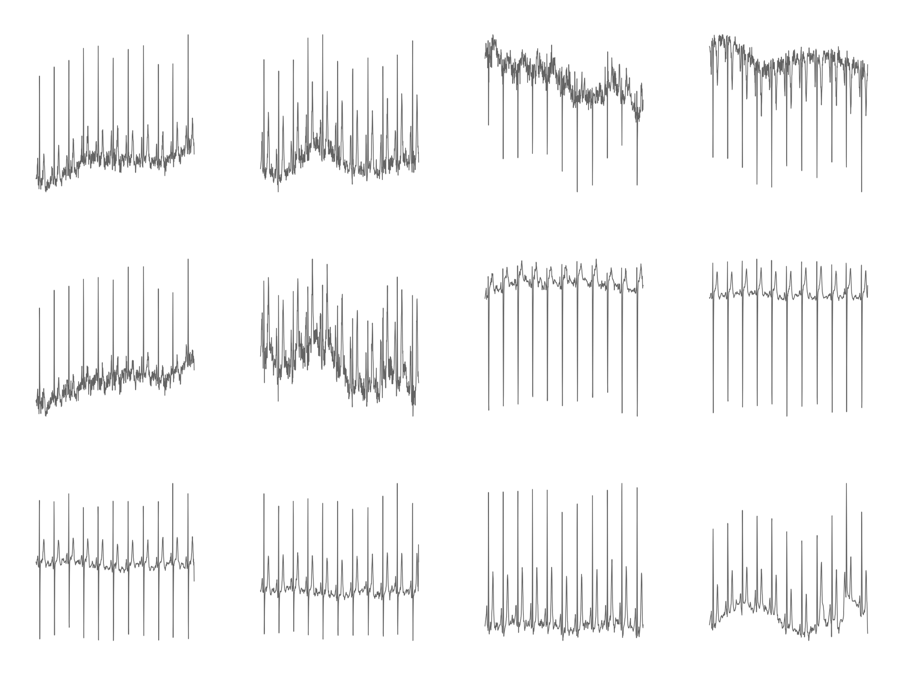
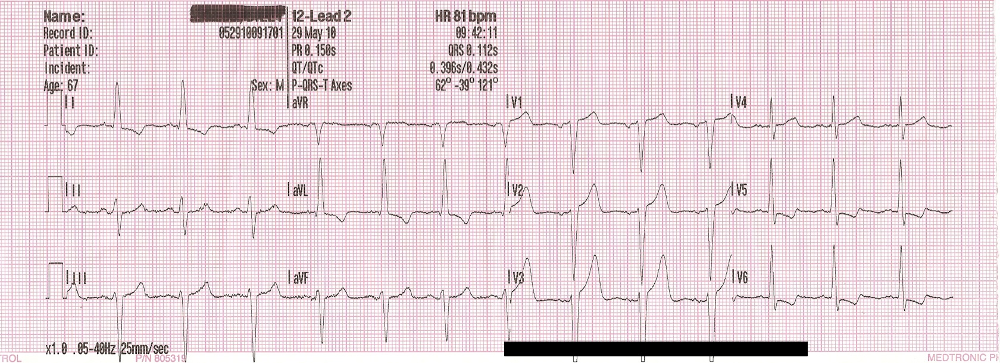
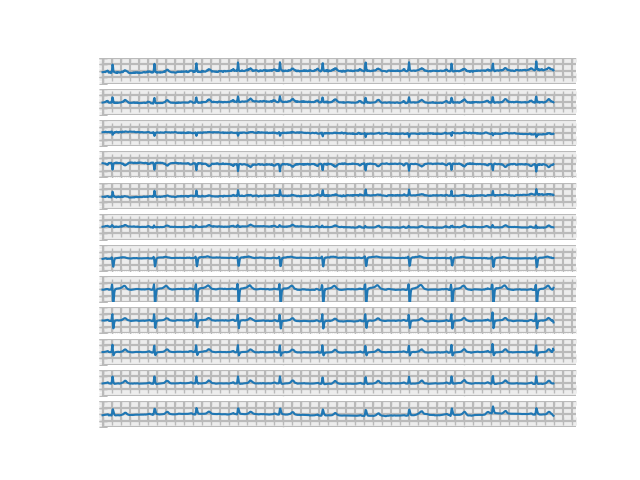
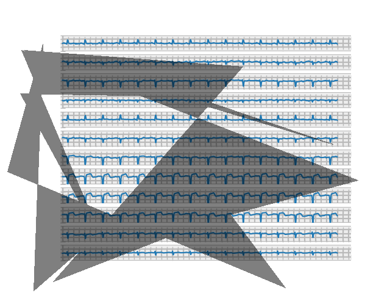

TODO: turn finished draft into webpage

# Introduction

Heart disease is consistently the number one cause of death in America, and 805,000 heart attacks occur in the US annually. (1)  Effective heart attack treatment relies on rapid diagnosis through 12-lead EKG in order to minimize the time to reperfusion therapy, and one of the largest improvements in the speed of diagnosis and treatment has been achieved through pre-hospital EKG analysis by Emergency Medical Services personnel.  For instance, one study found pre-arrival EMS identification of ST-Elevated Myocardial Infarction through 12-lead EKG lowered patients’ 30-day mortality rates from 15.3% to 7.3%, and 5-year mortality rates from 20.6% to 11.6%. (2)

Yet despite the well-established lifesaving effects of performing pre-hospital 12-lead EKGs, many EMS systems continue to rely on Basic Life Support-level providers untrained in EKG interpretation.  For instance, the Detroit EMS system, which handles approximately 100,000 calls annually is predominately staffed by BLS units, and Michigan has a statewide shortage of hundreds of ALS-level paramedics who would be trained to perform EKGs. (3)  The result is that heart attack patients don't have EKGs performed before hospital arrival, resulting in slower diagnosis, slower treatment, and substantially higher mortality.

In such EMS systems where staff trained in EKG interpretation are unavailable, automatic computer interpretation of EKG could potentially fill in the gap to provide the lifesaving benefits of pre-hospital diagnosis to  heart attack patients.  However, current STEMI detection algorithms in use on EKG monitors are famously inaccurate and unreliable.  For instance, one study found that a commonly used EMS monitor identified just 58% of STEMis, potentially resulting in 42/100 missed cath lab activations. (4)

The past few years have seen researchers achieve breakthrough accuracy levels in automatic EKG interpretation using neural-network based approaches, in many cases rivaling or surpassing the accuracy of clinical providers.  However, such algorithms have yet to be widely applied to actual healthcare practice.  One barrier to such application has been the fact that all such algorithms have been developed to interpret digital EKG signals, which in the field are only available to software directly interfacing with an EKG monitor.  Clinical implementation of such algorithms would either need to be done on proprietary software run on EKG monitors themselves, or else on hardware with the ability to interface directly with EKG monitors to receive digital signals.  In either case, such implementation would be difficult both for researchers and clinical practitioners.

We attempt to resolve this difficulty by testing an alternate approach to neural-network based STEMi detection using images.  While digital signals are difficult to directly obtain in clinical practice, EKG monitors are equipped with printing capabilities that are routinely used to record readings.  If neural networks can accurately detect STEMis in images of 12-lead EKGs, then such printouts could be used as the basis of classification independently of the specific EKG device.  For instance, we envision an image-based approach being the basis of a mobile phone application that would allow providers to easily take a photo of an EKG printout and have it automatically classified.   Such an application could be developed by any researchers without needing access to proprietary software, and could be applied in clinical practice by healthcare agencies without needing to purchase specialized equipment.  Thus the feasibility of an image-based classification approach for EKGs could represent a large step in bridging the gap between research achievements and clinical practice.

A challenge to this approach, however, is the lack of a publicly available dataset of annotated 12-lead EKG printouts.  To test the feasibility of our approach with publicily available data, we create a dataset by plotting each lead of digital signal-based readings and combining the plots from each lead into a single image.  The result is images that approximate 12-lead EKG printouts.

Another substantial challenge is the fact that, depending on the part of the heart affected by MI, diagnostic features such as ST-elevation can appear in different leads and thus different parts of the image.  This challenge requires us to design and train our neural network in a way that can recognize these features regardless of where they appear in the image.  Furthermore, even baseline EKGs can look dramatically different from patient to patient with a wide variety of arrhythmias existing, and MI potentially presenting with different characteristic features.  We attempt to overcome this fact by training on a large and diverse dataset, as well as carefully designing the layers of our network.

Our finished neural network replicates the high level of accuracy seen in previous work, suggesting the feasibility of automatically classifying EKGs through images of printouts.  These results support the development of an application for computer STEMi recognition that can be easily integrated into clinical practice, and suggest that such an application can extend the lifesaving benefits of pre-hospital EKG interpretation to patients currently unable to receive it.

Ethical concerns for our project include potential biases in our dataset, which could influence our model’s performance.  Testing an application based on our model in clinical practice will also raise ethical concerns due to not only concerns for patient safety, but the difficulty of obtaining informed and carefully considered consent from patients suffering from heart attack.  Finally, the use of neural networks to make clinical treatment decisions raises broader concerns about the influence such practices may have on healthcare system design and practice.

# Related Works:

In this section, we will discuss relevant research pertaining to the application of neural networks to STEMi detection in EKGs. Past studies using convolutional neural networks (CNNs) have achieved high accuracy and sensitivity classifying STEMi's from various sets of leads. A study using 4-lead EKGs, sub-2d convolutional layers, lead asymmetric pooling layers to combine data from the multiple leads to achieve a 96% accuracy classifying Anterior STEMis. The algorithm's real-time performance was tested on a lightweight embedded system and found to be suitable for application in EKG wearable technologies. (Liu, et al., 2018)

A study more pertinent to our project's scope combines image-based deep learniing techniques to improve detection accuracy of an important marker for detecting myocardial ischemia in EKGs: a ST depression change. The CNN created yields an average AUC at 89.6% from an independent set, a mean sensitivity rate at 84.4% and a specificity at 84.9% at selected optimal cutoff thresholds. (Xiao, et al., 2018)

Another study using a CNN and 12-lead EKGs, proposed a performance optimization technique through two data pre-processing methods: noise reduction (notch filter and high pass filter) and pulse segmentation (via QRS complex detection). The 
preprocessing techniques improved the sensitivity, specificty, and area under the curve (AUC) of the receiver operatnig characteristic (ROC), enhanncing STEMi detection performance on a 275 EKG record dataset with 179 STEMis and 96 normal (Park, et al., 2019).

Due to the complexity of classifiers like CNNs and other neural networks, key decision makers like physicians and experienced clinicians stigmatize the black-box nature of neural network-based diagnoses. A more recent study using a ML fusion model consistening of Logistic Regression (LR), Artificial Neural Network (ANN), and Gradient Boosting Machine (GBM) and modified approach using 554 temporal-spatial features of 12-lead EKGs from a sample size of 1244 patients was able to achieve a 52% gain over commercial software ad 37% gain over "experienced" clinicians. From the study, the researchers concluded that linear classifiers like LR are just as effect as ANN, which lends the use of linear classification favorability in clinical practice (Al-Zaiti, et al., 2020).

# Methods
TODO: Lucky add writeup of hyperparameter tuning

To generate our image datasets, we use the PTB-XL dataset, a collection of 21,837 labeled EKG records published by Physionet.  5,486 (25%) of these EKGs are labelled as indicating Myocardial Infarction, while the remainder are either labelled Normal (9,528 / 44%) or as displaying a different abnormality not indicative of Myocardial Infarction (7,326 / 34%); for our purposes, we consider both of the latter to be "Normal".  Each file is a digital recording of electrical activity in 12 standard ECG leads over 10 seconds, as would typically be seen in the emergency setting when diagnosing Myocardial Infarction.  While the initial recordings were made at 500 Hz, the dataset also offers versions downsampled to 100 Hz, which we use throughout this study due to its closer resemblance to the frequencies measured by heart monitors in emergent clinical practice.

We create an initial dataset by using Physionet's WFDB-Python library to read the numerical data from each record into a 12x1000 numpy array.  We then plot the 1000 numerical data points from each lead with Matploblib.  We transform the resulting plot into a 512x512 pixel grayscale image with OpenCV, then after repeating this process for all 12 leads we concatenate the resulting images.  The result is one 3 x 4 image displaying all 12 leads for each patient (see figure in discussion).  We use pandas to extract labels from a CSV file in the initial dataset and move each image to a parent directory indicating its label as "mi" or "normal"; the result is "Dataset 1".

Iterating on our first generation efforts, we then generate a second dataset by using WFDB-Python's plotting functions instead of directly passing numerical data to Matplotlib.  We enable an option in these functions to draw a background grid similar to those typically seen in EKG printouts.  We modify the source code of the WFDB plotting functions to allow the editing of the resulting figure with Matplotlib, then standardize the vertical limits of each plot's display and remove figure features such as tick marks, legends, and axes labels.  As before, each file is moved to a parent directory indicating its label, resulting in "Dataset 2" (see figure in discussion).

We then take our second dataset and attempt to augment our initial data to simulate an irregularity commonly seen in mobile phone photographs of EKG printouts: shadow overlying the image.  We use the Automold Road Image Augmentation Library to randomly add between 1 and 3 5-vertex shadows to each image in Dataset 2.  We save the results as new images, resulting in "Dataset 3" (see figure in discussion).

Finally, to test the classification of our images using an RNN, we generate a fourth dataset with each lead in its own image.  We use the same methods as for Datset 1, except stopping after generating a figure of each lead with Matplotlib.  No transformation is applied with OpenCV, nor are the images concatenated together.  The result is 12 images for each patient plotting each of the 12 EKG leads separately, making up "Dataset 4" (see figure in discussion).

The software used to build and train the convolutional neural network was PyTorch and fastai. 

To contextualize the performance of our CNN, we felt compelled to build and train another type of neural network. Ultimately, we decided on the RNN, which is distinguished by its memory capacity — when generating outputs, it recalls things learned from prior inputs. We believed that such a quality would be relevant to EKG classification, as Myocardial Infarction EKGs often contain complementary ST manifestations on the different leads (i.e., an ST elevation in one lead is coupled with an ST depression in other), and we hypothesized that a NN model with the ability to recall characteristics of previous leads would have an upper hand in MI diagnosis. 

The RNN training dataset was adapted from Dataset 4: we converted each patient's 12 lead images (i.e., the images in each subdirectory of Dataset 4) to tensors and stacked them, producing one tensor for every patient. Then, we saved each resulting tensor in a file and added a corresponding mi or normal label. 

To create the RNN, we first adapted a Pytorch implementation of a Convolutional LSTM ([https://github.com/ndrplz/ConvLSTM_pytorch](https://github.com/ndrplz/ConvLSTM_pytorch)), specifying one LSTM layer, 10 hidden layers, and a kernel size of 3. Next, we used Pytorch to flatten the LSTM layer to a single tensor, before applying a linear transformation and a sigmoid activation function. For the RNN training process, we selected Binary Cross Entropy for our cost function, Adam for our optimization algorithm, two for our batch size (to accommodate our GPU memory constraints), and ten for the number of epochs.

# Discussion

TODO: Lucky add writeup of hyperparameter tuning results
TODO: add figure for human ekg accuracy

Our first generated image dataset successfully plotted EKG waveforms and allowed training of a CNN; however, the generated images bore several striking differences from real-world EKG printouts (see figures below).  First, many images in our dataset show repeated large positive or negative vertical spikes not seen in normal EKG printouts.  While EKG waveforms do contain various peaks and valleys, these also exist in our dataset and bear a distinct shape from the spikes, which instead seem to be the result of single very high or low outlier data points.  EKG readings always contain some amount of noise or artifact, which may be the source of such outlier data points.  Other studies classifying EKG data have pre-processed data with notch or high-pass filters, which would remove extreme outliers; it's possible that clinical EKG monitoring equipment employs similar techniques that prevent such spikes from displaying on printouts.

The images in dataset 1 are also significantly more choppy than typically seen in real EKG printouts.  This can partially be explained by the sampling resolution of our data, which at 100 Hz is significantly higher than resolutions in the 40-60Hz range recorded by many clinical monitors; the result is less "smooth" lines as more fine-grain details of the waveform are captured.  It's also possible that other pre-processing techniques to smooth data are used by clinical equipment, in order to reduce the effects of noise and make waveforms easier for humans to read.  Other notable differences include the lack of a background grid in our images and the separation of each lead by a significant amount of whitespace.

Despite these differences, however, the fact that a CNN was able to classify these images with a high degree of accuracy indicates that these images successfully visualize the important diagnostic features in each record.  As such, the dataset successfully serves its purpose as a proof of concept for image-based classification of EKGs, despite its lack of realistic representation of the sort of images we were hoping to simulate.

Fig. 1: Image from Dataset 1
 

Fig. 2: Image of real EKG printout for comparison

Our second dataset addresses many of the issues with the first by utilizing the WFDB library's plotting functions, which eliminates both the large vertical spikes and much of the choppiness in the original images.  Not only does this dataset produce smoother and more realistic looking waveforms, but it also adds a background grid and removes most of the excess whitespace separating images.  However, dataset 2 did introduce a separate issue in the layout of each lead in the image.  While real EKG images are typically arranged in a 3 x 4 grid, these images vertically stack all leads in a single column.  We opted not to horizontally concatenate the leads from each image in this way due to finding that each plot was substantially wider than typically seen in EKG printouts, possibly indicating the 10-second samples in our data represent a longer timespan than is usually captured in a single printout.  While we considered taking a narrower subset of the image, doing so could possibly result in removing the section of the EKG where the key diagnostic features determining it as an MI are present.  Without beaty-by-beat annotation of our dataset, we opted to leave the images in a one-column format.  Again, this dataset was able to be classified with a high degree of accuracy by a CNN, indicating that it successfully visualized key diagnostic features and serves as proof of concept for image-based EKG classification.

Fig. 3: Image from dataset 2

Our augmentation in the third dataset successfully simulated one of the most common distortions present in real pictures of EKG printouts: shadow overlaying the image.  While the shadows produced aren’t entirely realistic, they do provide a good test for the sort of artifact a classifier would have to overcome on EKG images captured during clinical practice.

Fig. 4: Image from dataset 3

Finally, our fourth dataset generated individual lead images similar to those that might be captured by photographing part of an EKG printout at a time.  These allowed us to feed sequential images into an RNN to test the performance of such a network on MI classification.

Fig. 5: Image from dataset 4

With our first generated image dataset which was 512x512 images, we could not increase the batch size beyond 16. In order to pass this threshold, we reduced the size of the images in the second data set and experimented with different image sizes and various batch sizes.
Below are the results from our batch size testing on reduced image sizes:

Control: Batch size = 16, no resizing
epoch     train_loss  valid_loss  error_rate  time    
0         1.193201    0.861575    0.305000    00:07                              
epoch     train_loss  valid_loss  error_rate  time    
0         1.175750    0.778355    0.350000    00:10                              
1         1.103686    0.751094    0.300000    00:10                              
2         0.972977    0.609927    0.260000    00:10                              
3         0.879336    0.703814    0.360000    00:10 

Batch size = 16, items_tfms=Resize(300)
epoch     train_loss  valid_loss  error_rate  time    
0         1.193201    0.861575    0.305000    00:08                              
epoch     train_loss  valid_loss  error_rate  time    
0         1.175750    0.778355    0.350000    00:10                              
1         1.103686    0.751094    0.300000    00:10                              
2         0.972977    0.609927    0.260000    00:10                              
3         0.879336    0.703814    0.360000    00:10 

Batch size = 16, items_tfms=Resize(300)
epoch     train_loss  valid_loss  error_rate  time    
0         1.193201    0.861575    0.305000    00:07                              
epoch     train_loss  valid_loss  error_rate  time    
0         1.175750    0.778355    0.350000    00:10                              
1         1.103686    0.751094    0.300000    00:10                              
2         0.972977    0.609927    0.260000    00:09                              
3         0.879336    0.703814    0.360000    00:09 

Batch size = 14
epoch     train_loss  valid_loss  error_rate  time    
0         1.174931    0.863961    0.335000    00:08                                                                 
epoch     train_loss  valid_loss  error_rate  time    
0         1.166424    1.126207    0.455000    00:10                                                                 
1         1.031477    0.636147    0.260000    00:10                                                                 
2         0.954057    0.958069    0.420000    00:10                                                                 
3         0.815557    0.648650    0.300000    00:10

Batch size = 12
epoch     train_loss  valid_loss  error_rate  time    
0         1.204409    0.958627    0.400000    00:08                              
epoch     train_loss  valid_loss  error_rate  time    
0         1.151761    1.094397    0.395000    00:10                              
1         1.023440    2.890649    0.495000    00:10                              
2         0.891081    0.844348    0.360000    00:10                              
3         0.826468    0.630925    0.310000    00:10 

Batch size = 24, items_tfms=Resize(400)
epoch     train_loss  valid_loss  error_rate  time    
0         1.167504    0.818557    0.345000    00:07                              
epoch     train_loss  valid_loss  error_rate  time    
0         1.117804    0.810464    0.335000    00:09                              
1         1.038550    0.655865    0.275000    00:09                              
2         0.987740    0.615587    0.275000    00:09                              
3         0.919624    0.536605    0.275000    00:09  

Batch size = 32, items_tfms=Resize(400)
epoch     train_loss  valid_loss  error_rate  time    
0         1.128878    0.863806    0.370000    00:07                              
epoch     train_loss  valid_loss  error_rate  time    
0         1.112206    0.707882    0.355000    00:09                              
1         1.031291    0.644120    0.300000    00:09                              
2         0.947920    0.712319    0.300000    00:09                              
3         0.867006    0.690136    0.285000    00:09

Batch size = 32, items_tfms=Resize(400)
epoch     train_loss  valid_loss  error_rate  time    
0         1.179415    0.832696    0.415000    00:07                              
epoch     train_loss  valid_loss  error_rate  time    
0         1.124885    0.746533    0.350000    00:09                              
1         1.061206    0.977342    0.370000    00:09                              
2         1.014017    0.754363    0.315000    00:09                              
3         0.958239    0.658920    0.285000    00:09  

As you can see, increasing the batch size with 400x400 images did not lead to improvements in the error_rate (from 0.285 error rate in epoch 3 batch_size=24 to 0.285 error rate in epoch 3 batch_size=32). Our testing needs to further check the increase from a batch size of 16 to a batch size of 24 for 400x400 images. 

The RNN we created was unsuccessful: we observed that throughout the entirety of the training process, the cost fluctuated drastically from training sample to training sample, rotating among the values of 0.0, 50.0 and 100.0. Since the training cost exhibited no decreasing or stabilizing patterns, we conclude that our RNN failed to learn.

Our CNN results suggest the feasibility of image-based EKG classification in clinical practice, although also point to the need for future work to augment transfer learning with other problem-specific techniques to attain accuracy high enough for clinical application, where the acceptable error rate is very low.  Missing a Myocardial Infarction could result in lack of treatment that could potentially cause outcomes up to death, while false positive diagnosis could potentially subject a patient to unnecessary invasive procedures with similarly severe consequences.  Error rates in STEMi classification by Emergency Room Physicians are approximately 3% (5), and prior non-image based work has achieved a similar level of accuracy.  However, our classifier already substantially outperforms general physicians and Emergency Room Residents, who have been found to have accuracy rates of 70% and 68% respectively (6).  It also outperforms the non-neural network based algorithm used in the LifePak 12, one of the most popular devices for pre-hospital 12-lead EKG acquisition by EMS, which one study noted only detected 58% of STEMIs (7)

## Ethics
Our work touches on a number of ethical issues and dilemmas, including: 
- Who is held responsible in the case where the model's prediction is incorrect and the diagnosis and treatment lead to an unfavorable outcome for the patient?
- Issues around collection of sensitive health data - should it be collected in an effort to improve the model? In what way should it be collected?
- Does the data used to train the model capture the heterogeneity of the real world? How can a more comprehensive dataset be assembled?
- How do we find and remove potential biases in the dataset? 
- Who benefits from the development and potential commercialization of such a tool?

Such questions are important in assessing the model and making sure that introducing it in the health system will be beneficial and not cause harm.

TODO: Georgia add ethics session either separate or part of discussion?

# Reflection

Our work mostly acts as a proof of concept, pointing to the possibility of future work by researchers with access to proprietary EKG image datasets and/or partnership with clinical researchers to confirm the viability of classifying EKG images obtained in real clinical settings. While our goal was to create an app that assists EMTs and other health professionals in quickly and accurately diagnosing patients, we recognize that our current model requires more work and calibration to achieve this. For example, the image dataset that we generated is still not sufficiently similar to real EKGs, or what a picture of an EKG may look like. While we tried to plot and visualize the data to resemble as closely as possible an actual EKG, improvements can be made. For example, the plot lines can be made to appear red, which is typically the color of EKGs (see Fig. 2); further image augmentation and more realistic shadows may be implemented to mimic real-world pictures; in general, improvements in the visual representation of the data that make it appear more similar to real EKG printouts may lead to lower error rates when the model is tested on real pictures. Ideally, a dataset of real pictures of EKGs can be assembled and used to train the model.

Additionally, further experimentation with adding more and different types of layers to the NN, as well as changing batch size, is needed to achieve the best accuracy-computation cost trade-off. Finally, in an attempt to asses the need for such a tool (as well as its impact), a more thorough understanding of the ethics must be achieved.

## Citations:
1. https://www.heart.org/-/media/phd-files-2/science-news/2/2021-heart-and-stroke-stat-update/2021_heart_disease_and_stroke_statistics_update_fact_sheet_at_a_glance.pdf?la=en
2. Bång A, Grip L, Herlitz J, et al. Lower mortality after prehospitalrecognition and treatment followed by fast tracking to coronary carecompared with admittance via emergency department in patients withST-elevation myocardial infarction. Int J Cardiol 2008;129:325-32
3. https://nihcr.org/wp-content/uploads/2017/06/NIHCR_Altarum_Detroit_EMS_Brief_5-30-17.pdf
4. https://www.tandfonline.com/doi/abs/10.3109/10903127.2012.722176
5. https://emupdates.com/wp-content/uploads/2008/07/Hartman-4-Steps-to-STEMI-Diagnosis-AmJEM-2012.pdf
6. https://academic.oup.com/eurheartj/article-abstract/40/Supplement_1/ehz748.0231/5598215
7. https://www.tandfonline.com/doi/abs/10.3109/10903127.2012.722176
